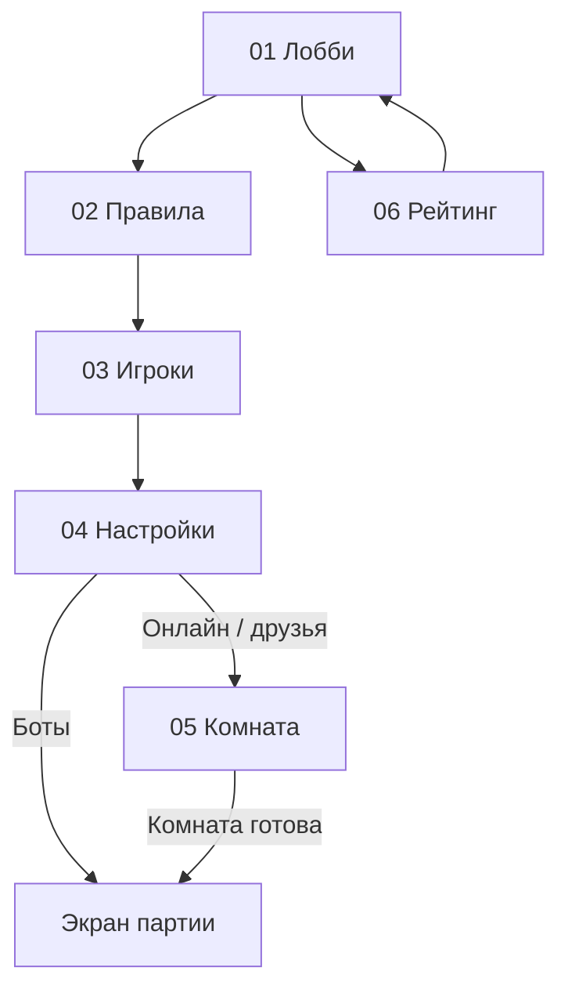

# Переходы и состояние для Claude Code

Эта инструкция описывает рекомендуемое поведение на основании предоставленных экранов. Изображения подтверждают внешний вид и показанные варианты, но не содержат backend-контрактов, алгоритма рейтинга или полного свода правил. Сохраняй существующие правила и API проекта; недостающие решения ниже помечены как рекомендации.

## Шесть экранов

| ID | Экран | Откуда открывается | Основное действие |
| --- | --- | --- | --- |
| 01 | Лобби | Вход в игру Дурак | Онлайн / Боты / Пригласить друзей → 02; Рейтинг → 06 |
| 02 | Правила | Выбор режима в лобби | Сохранить variant → 03 |
| 03 | Игроки | Шаг 1 | Сохранить format/playerCount → 04 |
| 04 | Настройки | Шаг 2 | Боты → партия; онлайн/друзья → 05 |
| 05 | Комната | Создание/вход в онлайн-комнату | Приглашение, ожидание готовности, старт → партия |
| 06 | Рейтинг | Вкладка в лобби | Смена фильтров; Лобби → 01 |



Это схема навигации, не указание создать дополнительные рисунки. Экран партии уже существует отдельно. Кнопка «Профиль» ведет в существующий профиль; его макета в этих коллажах нет.

## Одна модель настройки на все шаги

Рекомендуемые поля (названия можно адаптировать):

```ts
type GameDraft = {
  mode: 'online' | 'bots' | 'friends';
  variant: 'throw-in' | 'transfer';
  format: 'individual' | 'teams-2v2';
  playerCount: 2 | 3 | 4 | 5 | 6;
  deckSize: 36 | 52;
  turnSeconds: 30 | 60 | null;
  botDifficulty: 'easy' | 'medium' | 'hard' | null;
};
```

При переходах «Далее» и «Назад» сохранять модель целиком. Метка режима, сводка правил, число мест, количество ботов и подписи получаются из нее. Значения по умолчанию брать из проекта; выбранные в макетах варианты — примеры оформления, а не обязательный дефолт.

В комнате отдельно хранить фактические `roomId`, участников и свободные места, `teamId`, хозяина комнаты, допуск подбора и готовность к старту. Источник истины — сервер комнаты. Форма не должна самостоятельно добавлять несуществующих участников.

## 01 — лобби

- «Играть онлайн»: режим online, далее мастер 02–04, затем комната 05.
- «Играть с ботами»: режим bots, тот же мастер; на шаге 04 доступна сложность и предупреждение об отсутствии рейтинга.
- «Пригласить друзей»: рекомендуемый сценарий — режим friends, мастер, затем приватная комната. Генерировать ссылку приглашения только после создания реальной комнаты. Если в проекте уже другой сценарий, сохранить его.
- Имя Алексей и рейтинг 1 240 — пример; заменить данными пользователя.
- Вкладка Рейтинг открывает 06; Профиль — имеющийся профиль.

## 02 — правила

Две взаимоисключающие карточки: подкидной и переводной. Весь блок кликабелен. Выбранная карточка получает лаймовую рамку и галочку, другая — пустой круг.

Тексты: «Подкидывайте карты того же достоинства» и «Переводите атаку следующему игроку». Это короткие объяснения, не полный набор игровых правил. Демо с двумя семерками показывать для переводного. Для подкидного не оставлять подпись о переводе; допустимо скрыть демо-блок, если нет соответствующего материала.

Переход на 03 сохраняет mode и variant. Назад — в 01 с сохранением черновика согласно поведению приложения.

## 03 — игроки

- «Каждый за себя»: разрешены варианты 2, 3, 4, 5, 6; число включает пользователя.
- «2 на 2»: ровно 4 участника. При переключении назначить playerCount=4; остальные варианты скрыть или заблокировать с понятным объяснением. При возврате к индивидуальному формату можно восстановить прежнее число, если это согласуется с UX проекта.
- В режиме bots число ботов равно playerCount−1.
- Схема рассадки должна отражать выбранное число мест; изображение содержит только пример на 4 места. Для 2,3,5,6 разместить аватары компонентами по периметру стола.
- В командном режиме партнеры сидят напротив. Цвет команды обозначает принадлежность, не готовность участника.
- В исходнике выбрано «Каждый за себя», но под схемой написано «В режиме 2 на 2 — четыре игрока, партнёры сидят напротив». Это несогласованность макета: в работающем интерфейсе показывать эту подсказку только при 2 на 2, а в индивидуальном режиме — соответствующую подпись либо ничего.
- Совместимость командного и переводного вариантов по картинкам не определяется. Использовать поддержку движка; если сочетание недоступно, объяснить и запретить именно эту комбинацию. Не менять выбранные правила молча.

## 04 — настройки

На предоставленном экране выбран отдельный пример: bots, transfer, individual, 6 участников, 36 карт, 30 секунд, средняя сложность. Не навязывать этот пример пользователю, пришедшему с 03.

- Колода: 36 или 52, взаимоисключающий выбор.
- Время: 30 секунд, 60 секунд или без таймера. Без таймера хранить null/аналог, не запускать мгновенное окончание хода.
- Сложность: легко, средне, сложно; показывать в бот-режиме. Не добавлять ботов в онлайн-комнату без предусмотренной продуктом функции.
- Сводка «Переводной · 6 игроков / Вы и 5 ботов» формируется из модели.
- Для bots: карточка «Тренировка без рейтинга», кнопка «Начать игру» запускает реальную партию, рейтинг не изменяется.
- Для online/friends: скрыть бот-специфичные контролы и текст о тренировке; CTA может называться «Создать комнату», после успешного создания открыть 05. Такое изменение текста рекомендовано для ясности.
- Не выводить на экран фиктивное «Боты готовы» до готовности. При запуске отображать загрузку и защищать от повторного нажатия.
- Если движок требует ограничения состава, колоды или времени, применять его проверки. Сам макет не задает дополнительных правил.

## 05 — онлайн-комната

Макет показывает другой отдельный пример: online, throw-in, teams-2v2, 4 места, 36 карт, 30 секунд, занято 3 места. Это не продолжение изображенной бот-настройки экрана 04.

Места: пользователь сверху; партнер Анна снизу; соперник Максим слева; свободное место справа. Имена заменяются данными участников. Плюс и пунктирное кольцо используются только для свободного места. Командные сводки обновляются при присоединении/выходе.

«Пригласить друга» открывает поддерживаемый проектом способ поделиться действительной ссылкой комнаты. Нажатие на свободное место можно связать с тем же действием. Не отправлять приглашения автоматически.

«Открыть подбор игроков» — переключатель допуска подбора, на рисунке включен. Изменять его через существующее API, учитывая права хозяина комнаты. Для друзей разумный исходный режим — закрытая комната; это рекомендация, согласовать с логикой продукта.

При 3/4 кнопка недоступна: «Ожидаем игрока…». Условия готовности и право запуска проверяет сервер; по одному счетчику нельзя гарантировать старт. После готовности допустима доступная кнопка «Начать игру» для хозяина, если так устроен проект. Ошибки входа, переполнение, отключение участника и повторное подключение должны отражаться в UI.

## 06 — рейтинг

Три независимых фильтра: аудитория (все/друзья), правила (подкидной/переводной), формат (личный/2 на 2). Выбор должен менять запрос/список и блок своего места. Показать загрузку, пустой результат и ошибку отдельно; не оставлять прежние цифры под новыми фильтрами.

На макете явно написано «Пример данных». Демонстрационные значения:

| Место | Имя | Очки |
| --- | --- | --- |
| 1 | Виктор | 2 480 |
| 2 | Мария | 2 350 |
| 3 | Андрей | 2 210 |
| 4 | Ольга | 2 080 |
| 5 | Дмитрий | 1 960 |
| 128 | Алексей / Вы | 1 240 |

Использовать их только для явно обозначенного демо. Не выдавать за данные аккаунта. При реальном API убрать маркировку демо и подставить ответ сервера. Если пользователь отсутствует в выдаче, показать «Нет рейтинга» или состояние проекта; не придумывать место.

Рейтинг 2 на 2 может оценивать пользователя или команду — этого макет не определяет. Подключить существующую модель; при ее отсутствии не выдумывать алгоритм начисления. Игры с ботами по показанному UX не рейтинговые.

## Минимальные сценарии проверки

1. Онлайн → переводной → 5 игроков → 52 карты → 60 секунд → комната: все значения сохранены.
2. Боты → подкидной → 6 игроков → 36 карт → средне → старт: 5 ботов, без рейтинга.
3. Переключение на 2 на 2 фиксирует 4 места и показывает командную подсказку; партнер напротив.
4. Назад с 04 на 03 и 02 не сбрасывает режим или правила.
5. В комнате 3/4 старт недоступен; присоединение четвертого обновляет экран по серверному событию.
6. Фильтры рейтинга запрашивают соответствующие данные; демо не смешивается с реальными значениями.
7. При узком экране CTA, все числа 2–6 и текст остаются доступны, нижняя панель не перекрывает контент.
